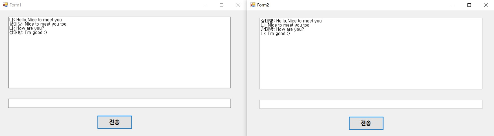

# Chat Application

- Chat Application
 : TCP를 공부하기 위해 만든 네트워크로 송수신하여 대화를 주고 받을 수 있는 간단한 어플리케이션.
 - TCPListener
 : TcpListener는 .NET에서 제공하는 클래스 중 하나로, 서버가 클라이언트의 TCP 네트워크 연결을 수신할 수 있도록 도와준다. 이 클래스는 System.Net.Sockets 네임스페이스에 속해 있다.
 TcpListener는 서버 개발에 주로 사용되며, 특정 IP 주소와 포트에서 클라이언트의 연결 요청을 기다리고 수락하는 기능을 제공한다. 클라이언트의 연결 요청을 수락하면, TcpClient 객체가 반환되며, 이를 통해 서버와 클라이언트 간에 데이터를 주고받을 수 있다.
 - TCPListener 사용방법
  1. Tcplistener로 사용할 port 번호를 정해준다.
  2. 새로운 TcpListener 객체를 만든다.
   server = new TcpListener(localAddr, port);
  3. 클라이언트의 요청을 받을 수 있도록 listening을 시작한다.
   server.Start();
  4. 클라이언트의 요청을 수신하면 연결 요청을 수락하고, 연결된 TcpClient 객체를 반환한다.(연결 요청이 올 때 까지 Blocking된다.)
   TcpClient client = server.AcceptTcpClient();
  5. 해당 클라이언트와 연결된 NetworkStream 객체를 얻고, 이 객체를 통해 데이터를 주고 받는다.
   NetworkStream stream = client.GetStream();